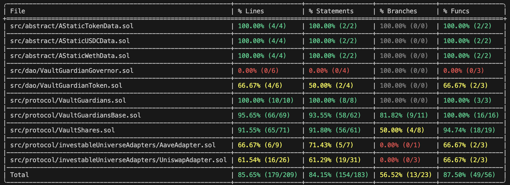

### [S-#] TITLE (Root Cause -> Impact)

**Description:** 

**Impact:** 

**Proof of Concept:**

**Recommended Mitigation:** 


### [H-#] Uniswap LP token can be `address(0)`, when `vault` asset is `weth`(weth/weth pair), causing irrecoverable functional failure and potential token loss during vault operations.

**Description:** In `VaultShares` in constructor, is fetched the uniswap LP token. 

```js
i_uniswapLiquidityToken = IERC20(
    i_uniswapFactory.getPair(address(token), address(counterPartyToken))
);
```

There was no validation that getPair() actually returned a valid deployed pair.
If the vault’s token and counterPartyToken are identical (e.g., both WETH),
Uniswap V2’s getPair() returns address(0) since no such pool can exist.

This means the vault would set:

```js
i_uniswapLiquidityToken = IERC20(address(0));
```

and continue execution without reverting.
Later, when the vault attempts to call `i_uniswapLiquidityToken.balanceOf()`, or Transfer LP tokens, or Redeem liquidity,
the transaction reverts with:

```js
call to non-contract address 0x0000000000000000000000000000000000000000
```

Now the vault becomes permanently unusable (funds could be stuck).

**Impact:** 

Vault logic dependent on LP token calls fails completely.
Vault cannot invest, withdraw, or divest.
Assets may become stuck or lost if the vault’s state becomes unrecoverable.

The issue breaks core functionality and potentially leads to permanent asset loss or vault lockup.

**Proof of Concept:**

Reproduction:

1. Vault initializes with WETH as asset.
2. `_uniswapInvest()` calls getPair(WETH, WETH) → returns address(0).
3. Vault sets i_uniswapLiquidityToken = IERC20(address(0)).
4. On withdrawal or reinvestment, vault reverts with:
"call to non-contract address 0x0000000000000000000000000000000000000000"
5. Vault becomes permanently stuck.

- Proof of Code:

Add this test in WethFork.t.sol in test/fork

Mock Uniswap Factory getPair() always returns a valid address, unlike real mainnet or forked scenario where address(0) is returned.

<details>
<summary>Code</summary>

```js
function testWethVaultGeneratesUniswapAddress0LP() public hasGuardian {
        vm.startPrank(user);
        wETH.deposit{value: mintAmount}(); // convert ETH -> WETH
        wETH.approve(address(wethVaultShares), mintAmount);
        wethVaultShares.deposit(mintAmount, user);

        uniswapLiquidityToken = wethVaultShares.i_uniswapLiquidityToken();

        console.log(
            "Uniswap LP token address:",
            address(uniswapLiquidityToken)
        );

        assertEq(address(uniswapLiquidityToken), address(0));
    }
```
</details>

**Recommended Mitigation:** 

The current design only allows weth as counter pair token.

Proposed solution:

 1. Add a dynamic detection for uniswap counter pair:
    - asset: weth -> counter pair: usdc
    - asset: not weth -> counter pair: weth

```diff
     // Dynamic LP counter-asset selection
+    if (constructorData.asset == constructorData.weth) {
         // asset is WETH, so use USDC as the counter asset for Uniswap LP
+        i_uniswapPairToken = IERC20(constructorData.usdc);
+    } else {
         // otherwise, standard case — use WETH
+        i_uniswapPairToken = IERC20(constructorData.weth);
+    }

     i_uniswapLiquidityToken = IERC20(
         i_uniswapFactory.getPair(
         address(constructorData.asset),
         // *** use a variable instead of hardcoding i_weth ***
+        address(i_uniswapPairToken)
         )
     );
```

Other solutions, but less ideal:

 2. Swap weth to usdc -> adds more complexity and moving parts

 3. Redistribution of uniswap allocation into aave allocation -> breaks investment diversification

 4. Prohibit weth vaults -> restrictive to users


### [H-#] `nonReentrant` is not the First Modifier in `VaultShares` which makes the functions vulnerable to reentrancy attacks

**Description:** 

Found in:
`VaultShares::deposit`
`VaultShares::rebalanceFunds`
`VaultShares::withdraw`
`VaultShares::redeem`

The placement of the divestThenInvest modifier before the nonReentrant modifier in the function signature creates a critical window for exploitation.

```js
function rebalanceFunds() public isActive divestThenInvest nonReentrant {}
```

**Impact:** Loss or manipulation of funds

This could allow an attacker to, for example, withdraw their share twice or call the divestment logic to retrieve tokens that they shouldn't have access to, leading to a direct loss of user funds from the vault.

A reentrant call could interrupt the process, leading to a situation where the contract's internal accounting is calculated based on incomplete or manipulated data.

**Proof of Concept:**

*** Mechanism of Attack ***

The Solidity compiler executes modifiers in the order they are listed.

1. isActive runs (a simple check, no external call, safe).

2. divestThenInvest runs:

- It executes the Divest logic, which includes external calls to third-party protocols (Uniswap and Aave) via _uniswapDivest and _aaveDivest.

- Since divestment from these protocols often involves the target protocol sending tokens back to the vault, these are external calls that transfer control flow.

3. Reentrancy Window Opens: An attacker (who controls one of the addresses or a token hook involved in the divestment) can trigger a malicious fallback or hook function in their contract during the divestment phase.

4. Bypass: The attacker's malicious code executes and immediately calls rebalanceFunds() again. Since the execution hasn't reached the nonReentrant modifier yet, the reentrancy lock has not been set.

5. Exploitation: The recursive call to rebalanceFunds() proceeds and executes the divestThenInvest logic a second time, potentially causing unauthorized state changes, double-claiming of funds, or manipulation of the fund's internal accounting before the first call can complete its state updates.

**Recommended Mitigation:** The fix is a best practice standard that should always be followed to prevent a reentrancy vulnerability from being introduced in the future:

Always place the nonReentrant modifier first in the function declaration.

```js
function rebalanceFunds() public nonReentrant isActive divestThenInvest {}
```


### [H-#] Using `block.timestamp` for swap deadline offers no protection

**Description:** The purpose of the deadline parameter in a swap function (like on Uniswap) is to specify a fixed future time after which the transaction will fail.

When deadline: block.timestamp is used, the deadline is set to the exact moment the transaction is included in the block.

The swap router contract usually checks: 

```js
require(deadline >= block.timestamp, 'EXPIRED');
```

**Impact:** Loss of funds(MEV Attacks), transactions stuck forever

The primary function of the swap deadline is to protect the user from slippage and Miner Extractable Value (MEV) attacks, specifically the sandwich attack. By nullifying the deadline check:

Enables Sandwich Attacks: A block producer (validator) can see the user's transaction in the mempool and hold it indefinitely. They can wait for the price to move favorably, execute a transaction just before the user's swap (front-running) to drive the price against the user, and a transaction just after (back-running) to pocket the difference. The user is guaranteed a bad price, and the block producer extracts maximum value.

Allows Arbitrary Delay/Censorship: The validator can delay the transaction for hours or even days, allowing huge price swings that exceed the user's intended slippage tolerance, leading to massive and unintended loss of funds.

The direct result of this vulnerability is the theft or extraction of value from the user, which places it firmly in the high-severity category.

**Proof of Concept:** If the user passes a fixed future time (e.g., block.timestamp + 300 seconds from the frontend), the check prevents the transaction from being executed after that time.

If the user passes block.timestamp from within the smart contract, the condition becomes require(block.timestamp >= block.timestamp), which will always be true.

The deadline check is completely bypassed, meaning the transaction never expires due to time and offers zero protection against high slippage or attacks by malicious block producers.

**Recommended Mitigation:** 

1. Use a future deadline window
Instead of:
deadline: block.timestamp
use something like:
deadline: block.timestamp + 300  // 5 minutes
or make it configurable.
That way:
Your transaction won’t be stuck forever (it expires in 5 minutes).
A validator can’t hold it indefinitely for manipulation.

2. Use MEV-resistant submission 
For high-value transactions:
Send the transaction via Flashbots Protect / MEV-Blocker RPC or similar RPC relayers.
These systems submit your transaction directly to block builders privately (not via the public mempool), preventing front-running and sandwiching.

### [M-1] Using unsafe ERC20 approve() operation in AaveAdapter.sol, UniswapAdapter.sol and VaultGuardiansBase.sol can result in stolen assets

**Description:** The ERC20 approve() function sets the spender’s allowance to a specific amount — but if there was already an allowance, it overwrites it. This creates a race condition known as the ERC20 approve front-running issue:
If someone can front-run your transaction between two approvals (e.g., approve(100) → approve(200)), they might use the old allowance before it’s updated.

Used in: 

`UniswapAdapter::_uniswapInvest`
`AaveAdapter::_aaveInvest`
`VaultGuardiansBase::_becomeTokenGuardian`

**Impact:** Loss of funds 

**Proof of Concept:**

You currently have allowance = 100.
You try to change it to 200.
Before your new approval is mined, the spender calls transferFrom(..., 100) — using the old allowance.
Your transaction sets allowance to 200 again → they can now pull 200 more.
This risk exists any time you use approve() to modify a nonzero allowance directly.

**Recommended Mitigation:** 

✅ Option 1 — Use SafeERC20.safeIncreaseAllowance
OpenZeppelin’s SafeERC20 has helper functions that safely add to the existing allowance instead of overwriting it:
asset.safeIncreaseAllowance(address(i_aavePool), amount);
This increases the allowance by amount rather than replacing it, and reverts on failure.
You don’t even need to check a boolean return — the SafeERC20 wrapper handles that internally.

✅ Option 2 — Use safeApprove(0) before setting new allowance
If you prefer the raw approve() semantics, the safe pattern is:
asset.safeApprove(address(i_aavePool), 0);
asset.safeApprove(address(i_aavePool), amount);
This clears the previous allowance first (per ERC20 recommendations), then sets the new one.
It ensures no residual approvals exist in between.

In this specific context ( Aave and Uniswap), the spender is a trusted protocol — it will only pull tokens during your supply()/addLiquidity() call, so the race condition isn’t a real-world exploit risk.

However, it’s still a bad pattern to replicate elsewhere, for example VaultGuardiansBase.sol.
If your vault ever interacts with other contracts dynamically (like different pools or adapters), it becomes dangerous.
So it’s still best practice to always use SafeERC20 helpers for approvals.


### [M-1] Centralization Risk

**Description:** These functions are using an access control library that put the power to make changes in the hands of a single entity, which is a centralization issue.

<details><summary>5 Found Instances</summary>


- Found in src/dao/VaultGuardianToken.sol [Line: 9](src/dao/VaultGuardianToken.sol#L9)

    ```solidity
    contract VaultGuardianToken is ERC20, ERC20Permit, ERC20Votes, Ownable {
    ```

- Found in src/dao/VaultGuardianToken.sol [Line: 21](src/dao/VaultGuardianToken.sol#L21)

    ```solidity
        function mint(address to, uint256 amount) external onlyOwner {
    ```

- Found in src/protocol/VaultGuardians.sol [Line: 40](src/protocol/VaultGuardians.sol#L40)

    ```solidity
    contract VaultGuardians is Ownable, VaultGuardiansBase {
    ```

- Found in src/protocol/VaultGuardians.sol [Line: 71](src/protocol/VaultGuardians.sol#L71)

    ```solidity
        function updateGuardianStakePrice(uint256 newStakePrice) external onlyOwner {
    ```

- Found in src/protocol/VaultGuardians.sol [Line: 82](src/protocol/VaultGuardians.sol#L82)

    ```solidity
        function updateGuardianAndDaoCut(uint256 newCut) external onlyOwner {
    ```

</details>

**Impact:** Contracts have owners with privileged rights to perform admin tasks and need to be trusted to not perform malicious updates or drain funds.

**Recommended Mitigation:** Consider some of the following recommandations to avoid centralization models:
1. Use a Multi-signature Wallet.
2. Time-lock Contract.
3. Governance by DAO.
4. Use of AccessControl library from OpenZeppelin, which restricts the access to a group of addresses instead a single one.


### [L-1] Unchecked return value 

**Description:** These functions return a value that is then ignored and can lead to several severe security and functionality consequences, especially in DeFi protocols dealing with asset transfers and external calls.

`VaultShares::divestThenInvest` - _aaveDivest(), _uniswapDivest()
`AaveAdapter::_aaveDivest`

**Impact:** The primary consequence is the loss of funds or a failure to execute critical protocol logic without the contract being aware.

**Proof of Concept:**

**Recommended Mitigation:** The necessary fix is to always check the return value of external calls that return a success indicator or an amount.

Example check pattern for value return: 

```js
if(returnedValue == 0) {
    revert ("No assets returned");
}
```

### [L-2] Unused State Variable in `VaultGuardiansBase`

**Description:** Declared variable is not used anywhere in the contract logic

```js
	    uint256 private constant GUARDIAN_FEE = 0.1 ether;
```

**Recommended Mitigation:** Consider removing it.


### [L-3] Unused error in `VaultGuardians`, `VaultGuardiansBase`

**Description:** 

<details><summary>4 Found Instances</summary>


- Found in src/protocol/VaultGuardians.sol [Line: 43](src/protocol/VaultGuardians.sol#L43)

    ```solidity
        error VaultGuardians__TransferFailed();
    ```

- Found in src/protocol/VaultGuardiansBase.sol [Line: 46](src/protocol/VaultGuardiansBase.sol#L46)

    ```solidity
        error VaultGuardiansBase__NotEnoughWeth(uint256 amount, uint256 amountNeeded);
    ```

- Found in src/protocol/VaultGuardiansBase.sol [Line: 48](src/protocol/VaultGuardiansBase.sol#L48)

    ```solidity
        error VaultGuardiansBase__CantQuitGuardianWithNonWethVaults(address guardianAddress);
    ```

- Found in src/protocol/VaultGuardiansBase.sol [Line: 51](src/protocol/VaultGuardiansBase.sol#L51)

    ```solidity
        error VaultGuardiansBase__FeeTooSmall(uint256 fee, uint256 requiredFee);
    ```

</details>

**Impact:** Can increase contract size and complexity.

**Recommended Mitigation:** Consider using or removing the unused errors.


### [L-4] PUSH0 Opcode

**Description:** The primary concern identified in the smart contracts relates to the Solidity compiler version used, specifically pragma solidity 0.8.20;. This version, along with every version after 0.8.19, introduces the use of the PUSH0 opcode. This opcode is not universally supported across all Ethereum Virtual Machine (EVM)-based Layer 2 (L2) solutions. For instance, ZKSync, one of the targeted platforms for this protocol's deployment, does not currently support the PUSH0 opcode.

The consequence of this incompatibility is that contracts compiled with Solidity versions higher than 0.8.19 may not function correctly or fail to deploy on certain L2 solutions.

**Impact:** The impact of using a Solidity compiler version that includes the PUSH0 opcode is significant for a protocol intended to operate across multiple EVM-based chains. Chains that do not support this opcode will not be able to execute the contracts as intended, resulting in a range of issues from minor malfunctions to complete deployment failures. This limitation directly affects the protocol's goal of wide compatibility and interoperability, potentially excluding it from deployment on key L2 solutions like ZKsync.

**Recommended Mitigation:** To mitigate this issue and ensure broader compatibility with various EVM-based L2 solutions, it is recommended to downgrade the Solidity compiler version used in the smart contracts to 0.8.19. This version does not utilize the PUSH0 opcode and therefore maintains compatibility with a wider range of L2 solutions, including ZKsync.


### [L-5] No `address(0)` check in `VaultGuardiansBase::_becomeTokenGuardian` for `tokenVault` and `token`

**Description:** These values are passed as parameters, generated by the calling functions (becomeGuardian and becomeTokenGuardian).

The functions (becomeGuardian and becomeTokenGuardian) are actually calling _becomeTokenGuardian and generate a non-zero address via new VaultShares(...) and user input for token. So here the contract logic and the `private` visibility help in guarding against assigning an address(0), but there are some edge cases when this could happen, like if the contract is upgraded and new functions or new logic is added.

```js
s_guardians[msg.sender][token] = IVaultShares(address(tokenVault));
```
**Impact:** The primary impact of the missing address(0) check in _becomeTokenGuardian is a potential for Corrupted State leading to a localized Denial of Service (DoS), which is only possible if the contract is upgraded, or if another internal function is added that fails to validate the input.

**Recommended Mitigation:** Add address(0) check before using the values in the `s_guardian` mapping entry.

```diff
function _becomeTokenGuardian(
        IERC20 token,
        VaultShares tokenVault
    ) private returns (address) {
+       if((address(token) == address(0) {
+          revert VaultGuardiansBase__InvalidToken();          
+       if(IVaultShares(address(tokenVault) == address(0) {
+          revert VaultGuardiansBase__InvalidAddress();   

        s_guardians[msg.sender][token] = IVaultShares(address(tokenVault)); 
        })
        //...
    }
```

### [L-6] In `VaultGuardiansBase::_becomeTokenGuardian` the guardian receives its `vgToken` before the vault creation is confirmed introducing a risk of reentrancy

**Description:** In order to become a vault guardian a user has to deposit a stake amount `s_guardianStakePrice`. In exchange for this stake amount the vault guardian receives the same amount of `vgToken`, which they use to get their stake amount back when they quit being a vault guardian. 

Here the code doesn't follow the Check-Effect-Interaction(CEI) principle and the vault guardian receives the `vgToken` before the tokenVault creation is confirmed successful.

```js
function _becomeTokenGuardian(
        IERC20 token,
        VaultShares tokenVault
    ) private returns (address) {
        s_guardians[msg.sender][token] = IVaultShares(address(tokenVault));

        emit GuardianAdded(msg.sender, token);
        
        i_vgToken.mint(msg.sender, s_guardianStakePrice);

        token.safeTransferFrom(msg.sender, address(this), s_guardianStakePrice);
        
        bool succ = token.approve(address(tokenVault), s_guardianStakePrice);
        if (!succ) {
            revert VaultGuardiansBase__TransferFailed();
        }
        uint256 shares = tokenVault.deposit(s_guardianStakePrice, msg.sender);
        if (shares == 0) {
            revert VaultGuardiansBase__TransferFailed();
        }
        return address(tokenVault);
    }
```

**Impact:** Potential loss of funds

Because the function doesn't follow CEI, it could pose a reentrancy risk, but the function is called internally by `VaultGuardiansBase` and the `vgToken` does not include a reentrancy vector, the Early Reward Minting vulnerability is mitigated for the purpose of a reentrancy attack.

Therefore its impact is reduced from a Critical reentrancy to a Low vulnerability.

However it is still a logic flaw (reward -> deposit -> check) and not good practice in function design.

**Recommended Mitigation:** Consider following the CEI pattern for operations flow.
The `vgToken` mint should be moved after the `deposit` check was performed.

```diff
function _becomeTokenGuardian(
        IERC20 token,
        VaultShares tokenVault
    ) private returns (address) {
        // Checks

        // Effects
        s_guardians[msg.sender][token] = IVaultShares(address(tokenVault));

        emit GuardianAdded(msg.sender, token);


        // Interactions
-       i_vgToken.mint(msg.sender, s_guardianStakePrice);

        token.safeTransferFrom(msg.sender, address(this), s_guardianStakePrice);
        
        bool succ = token.approve(address(tokenVault), s_guardianStakePrice);
        if (!succ) {
            revert VaultGuardiansBase__TransferFailed();
        }
        uint256 shares = tokenVault.deposit(s_guardianStakePrice, msg.sender);
        if (shares == 0) {
            revert VaultGuardiansBase__TransferFailed();
        }
        // Correctly executed after checking if deposit was successful
+       i_vgToken.mint(msg.sender, s_guardianStakePrice);

        return address(tokenVault);
    }
```

### [L-7] In `VaultGuardiansBase::_becomeTokenGuardian` an event is emitted `GuardianAdded` before the vault creation is confirmed leading to a false pozitive in the off-chain information flow

**Description:** In order to become a vault guardian a user has to deposit a stake amount `s_guardianStakePrice`. The event `GuardianAdded` is emmited before checking if the deposit was actually successful. This can lead to inconsistent information for the event readers.

Here the code doesn't follow the Check-Effect-Interaction(CEI) principle and the event is emitted before the state actually changes.

```js
function _becomeTokenGuardian(
        IERC20 token,
        VaultShares tokenVault
    ) private returns (address) {
        s_guardians[msg.sender][token] = IVaultShares(address(tokenVault));

        emit GuardianAdded(msg.sender, token);
        
        i_vgToken.mint(msg.sender, s_guardianStakePrice);

        token.safeTransferFrom(msg.sender, address(this), s_guardianStakePrice);
        
        bool succ = token.approve(address(tokenVault), s_guardianStakePrice);
        if (!succ) {
            revert VaultGuardiansBase__TransferFailed();
        }
        uint256 shares = tokenVault.deposit(s_guardianStakePrice, msg.sender);
        if (shares == 0) {
            revert VaultGuardiansBase__TransferFailed();
        }
        return address(tokenVault);
    }
```

**Impact:** While the state on-chain is correctly reverted, the misinformation can negatively affect systems relying on logs: front-ends, analytics and other smart contracts.

**Proof of Concept:**

1. The event is emitted, signaling to the outside world (off-chain indexers, UI dashboards, explorers) that msg.sender has successfully become a guardian.
2. The transaction continues to the deposit call, which fails (e.g., due to insufficient allowance, a vault error, or a low-level call failure).
3. The transaction executes the revert statement, undoing all state changes (including the s_guardians mapping update and the `vgToken` mint).
4. Result: External listeners will see an event log for GuardianAdded in a transaction that ultimately failed and reverted. 

This creates a confusing and incorrect picture of the contract's state.

**Recommended Mitigation:** Consider following the CEI pattern for operations flow.
The event emission must be moved to the final section of the function, after all checks and interactions have been successfully completed.

```diff
function _becomeTokenGuardian(
        IERC20 token,
        VaultShares tokenVault
    ) private returns (address) {
        // Checks

        // Effects
        s_guardians[msg.sender][token] = IVaultShares(address(tokenVault));

-       emit GuardianAdded(msg.sender, token);


        // Interactions
-       i_vgToken.mint(msg.sender, s_guardianStakePrice);

        token.safeTransferFrom(msg.sender, address(this), s_guardianStakePrice);
        
        bool succ = token.approve(address(tokenVault), s_guardianStakePrice);
        if (!succ) {
            revert VaultGuardiansBase__TransferFailed();
        }
        uint256 shares = tokenVault.deposit(s_guardianStakePrice, msg.sender);
        if (shares == 0) {
            revert VaultGuardiansBase__TransferFailed();
        }
        // Correctly executed after checking if deposit was successful
+       i_vgToken.mint(msg.sender, s_guardianStakePrice);
        // Correctly emitted after checking if deposit was successful
+       emit GuardianAdded(msg.sender, token);

        return address(tokenVault);
    }
```

 ### [L-8] Incorrect NAME & SYMBOL in `VaultGuardianBase::becomeTokenGuardian` when creating tokenVault for i_TokenTwo

**Description:** When an user calls becomeTokenGuardian a new tokenVault is created for the token the guardian has chosen. 
There are two accepted tokens, i_tokenOne and i_tokenTwo, with different name and symbol. But the function assigns `TOKEN_ONE_VAULT_NAME` & `TOKEN_ONE_VAULT_SYMBOL` for both token vaults, which is misleading to off-chain indexers.

```js
else if (address(token) == address(i_tokenTwo)) {
            tokenVault = new VaultShares(
                IVaultShares.ConstructorData({
                    asset: token,
                    // Invalid NAME & SYMBOL assign for i_tokenTwo
                    vaultName: TOKEN_ONE_VAULT_NAME,
                    vaultSymbol: TOKEN_ONE_VAULT_SYMBOL,
                    guardian: msg.sender,
                    allocationData: allocationData,
                    aavePool: i_aavePool,
                    uniswapRouter: i_uniswapV2Router,
                    guardianAndDaoCut: s_guardianAndDaoCut,
                    vaultGuardians: address(this),
                    weth: address(i_weth),
                    usdc: address(i_tokenOne)
                })
)}
```

**Impact:** The core problem is that the VaultShares contract, which represents the user's staked position, will use this name and symbol when created.

1. User Confusion and Loss of Trust (Primary Impact)Misleading Information: 
- A user who stakes LINK (represented by i_tokenTwo) will receive a receipt or see a token in their wallet named "USDC Vault Shares" (using TOKEN_ONE_VAULT_NAME and TOKEN_ONE_VAULT_SYMBOL).
- Trust and Error: This misalignment can cause panic, as the user might believe their funds were accidentally staked into the wrong asset vault, leading to support issues and a significant loss of trust in the protocol.

2. Broken Off-Chain Systems and Integration 
- DEX/Aggregator Misidentification: If the protocol integrates with any DEX, portfolio tracker, or DeFi aggregator, those services rely on the token symbol and name to correctly identify the underlying asset. If the LINK vault shares are labeled as USDC vault shares, the tracking systems will display incorrect portfolio values and holdings.
- Indexing Issues: Off-chain services that index all deployed vaults will see two distinct vault addresses (one for USDC, one for LINK) but with identical metadata, making it impossible to programmatically distinguish between them without reading the vault's internal asset variable.

**Recommended Mitigation:** Use the correct name & symbol for i_tokenTwo.

```diff
else if (address(token) == address(i_tokenTwo)) {
            tokenVault = new VaultShares(
                IVaultShares.ConstructorData({
                    asset: token,
                    // Use the correct NAME & SYMBOL assign for i_tokenTwo
+                   vaultName: TOKEN_TWO_VAULT_NAME,
+                   vaultSymbol: TOKEN_TWO_VAULT_SYMBOL,
                    guardian: msg.sender,
                    allocationData: allocationData,
                    aavePool: i_aavePool,
                    uniswapRouter: i_uniswapV2Router,
                    guardianAndDaoCut: s_guardianAndDaoCut,
                    vaultGuardians: address(this),
                    weth: address(i_weth),
                    usdc: address(i_tokenOne)
                })
)}
```

### [L-9] Return value not assigned to named return variable in `AaveAdapter::_aaveDivest`

**Description:** `_aaveDivest` calls `withdraw` on the Aave pool to retrieve the invested amount. This withdraw call returns a uint256 value, the received amount. `_aaveDivest` has declared a return variable `amountOfAssetReturned`, but the Aave pool withraw call return value it is never assigned to it. `_aaveDivest` will always return 0 in this case.

```js
function _aaveDivest(
        IERC20 token,
        uint256 amount
    ) internal returns (uint256 amountOfAssetReturned) {
        i_aavePool.withdraw({
            asset: address(token),
            amount: amount,
            to: address(this)
        });
    }
```

**Impact:** The consequence of this is that the calling function receives a 0. Since the return value is not used by the caller, the integrity of the protocol's logic is not affected. It's purely a broken function implementation. 

**Recommended Mitigation:** Assign the withdraw return value to the defined named return variable.
Explicit return is optional due to the named return param, but it is good practice for clarity. 

```diff
function _aaveDivest(
        IERC20 token,
        uint256 amount
    ) internal returns (uint256 amountOfAssetReturned) {
+       amountOfAssetReturned = i_aavePool.withdraw({
            asset: address(token),
            amount: amount,
            to: address(this)
        });
+       return amountOfAssetReturned;
    }
```


### [I-1] Consider cleaning repo 

**Description:** There are unused files: `IVaultGuardians`, `InvestableUniverseAdapter`

**Impact:** Can increase audit complexity

**Recommended Mitigation:** Consider deleting unused files and data


### [I-2] Insufficient test coverage 



**Recommended Mitigation:** Aim to get test coverage up to over 90% for all files and improve Branch testing.


### [I-3] No check on return value in `AaveAdapter::_aaveDivest` 

**Description:** `_aaveDivest` defines a named return value which is never assigned(see L-9) and never checked 

```js
function _aaveDivest(
        IERC20 token,
        uint256 amount
    ) internal returns (uint256 amountOfAssetReturned) {
        i_aavePool.withdraw({
            asset: address(token),
            amount: amount,
            to: address(this)
        });
        
    }
```

**Impact:** There is minimal impact becuase the return value it is not used by other functions and Aave's `withdraw` is expected to revert on failure, mitigating the most severe risk.

**Recommended Mitigation:** Add a check on the return value of `_aaveDivest`

```diff
function _aaveDivest(
        IERC20 token,
        uint256 amount
    ) internal returns (uint256 amountOfAssetReturned) {
+       amountOfAssetReturned = i_aavePool.withdraw({
            asset: address(token),
            amount: amount,
            to: address(this)
        });
+       if (amountOfAssetReturned == 0) {
+           revert AaveAdapter__NothingToWithdraw();
+       }
+       return amountOfAssetReturned;
    }
```


### [G-1] Functions marked `public` are not used internally

**Description:** A function is declared as `public` when it can be declared as external. The `public` visibility forces the compiler to generate code that copies all function arguments from calldata to memory (specifically, into the free memory pointer region) when the function is called.

This copying operation generates a significant gas consumption for every function call. When the function is only intended to be called by external accounts (EOAs) or other contracts, and not internally by other functions within the same contract. 

**Impact:** Using `public` leads to waste of gas, directly increasing the transaction cost for the user.

**Recommended Mitigation:** Change visibilty from `public` to `external`, if not used internally.