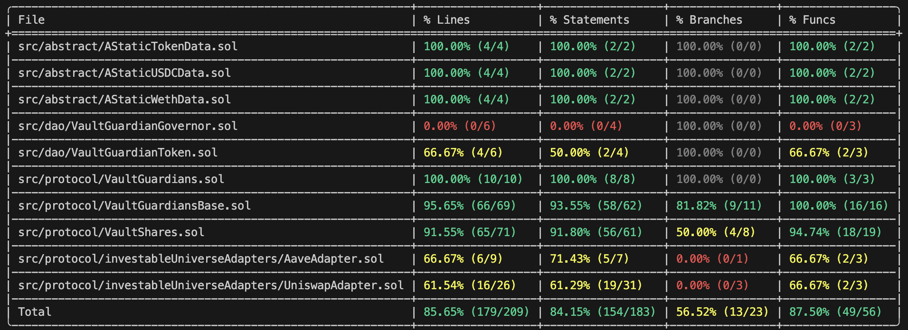

Commit hash: 0600272180b6b6103f523b0ef65b070064158303

Scope: src/

Roles: Vault Guardian 
       User

Test Coverage: Ok, Branches 56.52% - can be better



slither:

INFO:Detectors:
AaveAdapter._aaveDivest(IERC20,uint256) (src/protocol/investableUniverseAdapters/AaveAdapter.sol#42-48) ignores return value by i_aavePool.withdraw({asset:address(token),amount:amount,to:address(this)}) (src/protocol/investableUniverseAdapters/AaveAdapter.sol#43-47)
Reference: https://github.com/crytic/slither/wiki/Detector-Documentation#unused-return

=>=>=> Check for emiting event on any state change
=>=>=> Check DAO contracts for highs!!!
=>=>=> Check where the vault guardians can move funds, to what addresses
=>=>=> Check for proposal execution delays, otherwise might be space for ill intended proposals instant execution`

Can a vault have more than 1 guardian?

Low: Clean repo before submitting data for audit/review

## Is the protocol really upgradable? 

We can change the investment strategy, but
Can we add new investment strategies?

## Invariants

### Invariant 1:
The total vault value (on-chain + invested) must always be ≥ total user deposits.

```js
totalAssets() ≥ sum of user shares (in asset units)
```

```js
contract Invariant_VaultGuardian is BaseInvariantTest {
    function invariant_totalAssetsConservation() public {
        uint256 vaultTotal = vault.totalAssets();
        uint256 internalHoldings = vault.asset().balanceOf(address(vault));
        uint256 invested = aave.totalValue() + uni.totalValue();
        assertApproxEqAbs(vaultTotal, internalHoldings + invested, 1e6);
    }

    function invariant_allocationsSumTo100Percent() public {
        ( , , AllocationData memory alloc ) = vaultGuardian.getGuardianData(...);
        uint256 sum = alloc.holdAllocation + alloc.uniswapAllocation + alloc.aaveAllocation;
        assertEq(sum, vaultGuardian.ALLOCATION_PRECISION());
    }

    // etc.
}
```

### Invariant 2:

A guardian can never transfer tokens to arbitrary addresses.
You can track all external calls — for example:

```js
target != i_aavePool && target != i_uniswapRouter && target != vault
```

    => revert or no state change

That ensures funds never leak outside the investable universe.

### Invariant 3:

Vault token (vgToken) total supply always equals total user shares.

### Invariant 4:

Fees accumulated

--------------------------------------------------

_uniswapInvest() flow (Investing into Uniswap pool)

     ┌──────────────────────────┐
     │        Vault/Adapter     │
     │    (holds USDC initially)│
     └──────────┬───────────────┘
                │
                │ (1) Split USDC in half
                ▼
     ┌──────────────────────────┐
     │ Half stays as USDC       │
     │ Half will be swapped     │
     └──────────┬───────────────┘
                │
                │ (2) Approve + swap half for WETH via router
                ▼
     ┌──────────────────────────┐
     │  Uniswap Router          │
     │  (uses pool USDC↔WETH)   │
     └──────────┬───────────────┘
                │
                │ (3) Sends WETH back to contract
                ▼
     ┌──────────────────────────┐
     │ Now vault has:           │
     │ - USDC (half)            │
     │ - WETH (half swapped)    │
     └──────────┬───────────────┘
                │
                │ (4) Approve both tokens for liquidity
                ▼
     ┌──────────────────────────┐
     │ Uniswap addLiquidity()   │
     │ Adds USDC + WETH         │
     │ Returns LP tokens        │
     └──────────┬───────────────┘
                │
                │ (5) LP tokens minted to vault
                ▼
     ┌──────────────────────────┐
     │ Vault now holds LP tokens│
     │ (representing its stake) │
     └──────────────────────────┘

End result:
✅ Vault’s USDC → converted half to WETH → liquidity provided → received LP tokens.


_uniswapDivest() flow (Removing liquidity & reverting to USDC)
Step-by-step diagram
     ┌──────────────────────────┐
     │ Vault/Adapter            │
     │ (holds LP tokens)        │
     └──────────┬───────────────┘
                │
                │ (1) Remove liquidity via router
                ▼
     ┌──────────────────────────┐
     │ Uniswap Router           │
     │ removeLiquidity()        │
     │ returns USDC + WETH      │
     └──────────┬───────────────┘
                │
                │ (2) Tokens sent back to vault
                ▼
     ┌──────────────────────────┐
     │ Vault now has:           │
     │ - USDC                   │
     │ - WETH                   │
     └──────────┬───────────────┘
                │
                │ (3) Swap WETH → USDC
                ▼
     ┌──────────────────────────┐
     │ Uniswap Router           │
     │ swapExactTokensForTokens │
     └──────────┬───────────────┘
                │
                │ (4) Sends USDC back
                ▼
     ┌──────────────────────────┐
     │ Vault now fully in USDC  │
     │ LP tokens burned         │
     └──────────────────────────┘

End result:
✅ LP tokens burned → liquidity withdrawn → counter token swapped → all assets converted back into the vault’s base token (USDC).

⚖️ Token lifecycle summary

Stage	Asset held by vault	Description
Before invest	100% base token (USDC)	Vault holds only its underlying asset.
After invest	LP tokens	            Half swapped, liquidity added, LP tokens received.
Before divest	LP tokens	            Represents pooled USDC+WETH position.
After divest	100% base token again	LP burned, WETH swapped back to USDC.

🧠 Key takeaways

The adapter abstracts all Uniswap operations for the vault — so the vault doesn’t need to care about liquidity or swaps directly.
It always ensures the vault ends up back with its base asset after divesting.

X - Using block.timestamp as deadline and amountOutMin = 0 makes it vulnerable to slippage or MEV manipulation — should ideally be replaced with configurable parameters.


## Caught by Aderyn

### Issue: Unsafe ERC20 _approve operation in AaveAdapter.sol and UniswapAdapter.sol 

Your _aaveInvest function does this:
Calls asset.approve(address(i_aavePool), amount)
→ Grants the Aave pool permission to pull amount tokens from this contract.
If approval succeeds, it calls i_aavePool.supply(...) to actually deposit the tokens.
At first glance, this looks reasonable — but there are two safety caveats with using approve() directly.

⚠️ 1. ERC20 approve() quirks and race condition

The ERC20 approve() function sets the spender’s allowance to a specific amount — but if there was already an allowance, it overwrites it.
This creates a race condition known as the ERC20 approve front-running issue:
If someone can front-run your transaction between two approvals (e.g., approve(100) → approve(200)), they might use the old allowance before it’s updated.
Example:
You currently have allowance = 100.
You try to change it to 200.
Before your new approval is mined, the spender calls transferFrom(..., 100) — using the old allowance.
Your transaction sets allowance to 200 again → they can now pull 200 more.
This risk exists any time you use approve() to modify a nonzero allowance directly.

⚙️ Safer alternatives

✅ Option 1 — Use SafeERC20.safeIncreaseAllowance
OpenZeppelin’s SafeERC20 has helper functions that safely add to the existing allowance instead of overwriting it:
asset.safeIncreaseAllowance(address(i_aavePool), amount);
This increases the allowance by amount rather than replacing it, and reverts on failure.
You don’t even need to check a boolean return — the SafeERC20 wrapper handles that internally.
✅ Option 2 — Use safeApprove(0) before setting new allowance
If you prefer the raw approve() semantics, the safe pattern is:
asset.safeApprove(address(i_aavePool), 0);
asset.safeApprove(address(i_aavePool), amount);
This clears the previous allowance first (per ERC20 recommendations), then sets the new one.
It ensures no residual approvals exist in between.

⚙️ Why Aave is usually safe anyway

In this specific context (approving Aave’s pool contract), the spender is a trusted protocol — it will only pull tokens during your supply() call, so the race condition isn’t a real-world exploit risk.
However:
It’s still a bad pattern to replicate elsewhere.
If your vault ever interacts with other contracts dynamically (like different pools or adapters), it becomes dangerous.
So it’s still best practice to always use SafeERC20 helpers for approvals.


### Issue: Using `block.timestamp` for swap deadline offers no protection => should use a set time in the future, ex. block.timestamp + 300(5 min.)

Found in    `UniswapAdapter::addLiquidity`
            `UniswapAdapter::removeLiquidity`
            `UniswapAdapter::swapExactTokensForTokens`

In the PoS model, proposers know well in advance if they will propose one or consecutive blocks ahead of time. In such a scenario, a malicious validator can hold back the transaction and execute it at a more favourable block number.Consider allowing function caller to specify swap deadline input parameter.

1. Use a future deadline window
Instead of:
deadline: block.timestamp
use something like:
deadline: block.timestamp + 300  // 5 minutes
or make it configurable.
That way:
Your transaction won’t be stuck forever (it expires in 5 minutes).
A validator can’t hold it indefinitely for manipulation.

2. Use MEV-resistant submission (optional advanced defense)
For high-value transactions:
Send the transaction via Flashbots Protect / MEV-Blocker RPC or similar RPC relayers.
These systems submit your transaction directly to block builders privately (not via the public mempool), preventing front-running and sandwiching.


### Issue: No slippage protection => should use a slippage tolerance or let the user choose

Slippage risk
When you call swapExactTokensForTokens() with amountOutMin = 0, you’re saying:
“I don’t care how much I get back — give me whatever the market gives right now.”
But Uniswap’s price depends on pool reserves, so if:
The pool moves (price shifts between transaction submission and execution), or
A MEV bot front-runs your transaction and manipulates the pool price,
…you could lose a large percentage of your tokens.

🛡️ Countermeasures
✅ 1. Set a real slippage tolerance
Allow the user (or the vault logic) to specify a percentage tolerance for price movement.
Compute amountOutMin dynamically before swapping.
Example:

```js
function _getAmountOutMin(
    IUniswapV2Router01 router,
    address[] memory path,
    uint256 amountIn,
    uint256 slippageBps // e.g., 100 = 1%
) internal view returns (uint256) {
    uint256[] memory amountsOut = router.getAmountsOut(amountIn, path);
    uint256 expectedOut = amountsOut[amountsOut.length - 1];
    return (expectedOut * (10_000 - slippageBps)) / 10_000;
}
```

Then, when you swap:
```js
uint256 amountOutMin = _getAmountOutMin(i_uniswapRouter, s_pathArray, amountOfTokenToSwap, 100); // 1% slippage tolerance
```

```js
i_uniswapRouter.swapExactTokensForTokens({
    amountIn: amountOfTokenToSwap,
    amountOutMin: amountOutMin,
    path: s_pathArray,
    to: address(this),
    deadline: block.timestamp + 300 // 5-minute window
});
```

Practical pattern for your adapter
You can upgrade your _uniswapInvest() to:

```js
function _uniswapInvest(IERC20 token, uint256 amount, uint256 slippageBps) internal {
    IERC20 counterPartyToken = token == i_weth ? i_tokenOne : i_weth;
    uint256 half = amount / 2;
    s_pathArray = [address(token), address(counterPartyToken)];

    // Safe approval
    token.safeIncreaseAllowance(address(i_uniswapRouter), half);

    // Compute slippage-protected min output
    uint256 minOut = _getAmountOutMin(i_uniswapRouter, s_pathArray, half, slippageBps);

    uint256[] memory amounts = i_uniswapRouter.swapExactTokensForTokens({
        amountIn: half,
        amountOutMin: minOut,
        path: s_pathArray,
        to: address(this),
        deadline: block.timestamp + 300
    });

    ...
}
```

When you use Uniswap (or any DEX), you specify:
swapExactTokensForTokens(amountIn, amountOutMin, path, to, deadline)
The key safety parameter is amountOutMin —
the minimum acceptable amount of output tokens you are willing to receive.
If the actual DEX price moves too much and your swap would return less than this, the transaction reverts automatically, preventing a bad trade.
The helper _getAmountOutMin dynamically calculates this minimum based on the current DEX rate and your chosen slippage tolerance.

🔍 Function breakdown

```js
function _getAmountOutMin(
    IUniswapV2Router01 router,
    address[] memory path,
    uint256 amountIn,
    uint256 slippageBps // e.g., 100 = 1%
) internal view returns (uint256)
```

Inputs:
router: the Uniswap router contract you’re interacting with.
path: the swap path — e.g., [DAI, WETH] or [WETH, USDC, DAI].
amountIn: how much of the input token you’re swapping.
slippageBps: your maximum tolerated slippage, expressed in basis points (1 bps = 0.01%):
100 = 1%
50 = 0.5%
500 = 5%
Step 1: Ask the DEX what the current swap rate is
uint256[] memory amountsOut = router.getAmountsOut(amountIn, path);
This is a view function from Uniswap that returns how many tokens you’d currently get for that amount.
It looks up the reserves in the liquidity pools along your path and calculates the theoretical output using the constant product formula 
x∗y=k

Example:
If you call _getAmountOutMin(router, [DAI, WETH], 1000e18, 100)
and the pool price says 1 WETH = 2000 DAI,
then getAmountsOut(1000 DAI) will return [1000e18, 0.5e18].

Step 2: Take the final amount (the output token amount)
uint256 expectedOut = amountsOut[amountsOut.length - 1];
Since amountsOut has one element per hop in the swap path,
the last one is the final token you receive.
Example:
For [DAI, WETH], you get 2 elements: [inputDAI, outputWETH].
For [WETH, USDC, DAI], you get 3: [inputWETH, intermediateUSDC, outputDAI].
So, we take the last one: that’s your current expected output if the swap happened right now.

Step 3: Apply your slippage tolerance
return (expectedOut * (10_000 - slippageBps)) / 10_000;
Here’s what happens:
Multiply expectedOut by (10_000 - slippageBps)
Divide by 10_000 to scale down from basis points.
So if expectedOut = 0.5 WETH and slippageBps = 100 (1%):
(0.5 * (10_000 - 100)) / 10_000 = 0.495 WETH
Meaning:
You’ll accept the trade only if you receive at least 0.495 WETH —
if the price drops more than 1% between now and execution, the swap will revert.
💡 Why use 10,000 as the base?
Because 10,000 basis points = 100%.
That gives us nice precision down to 0.01%.
It’s the same convention used across DeFi protocols (Uniswap, SushiSwap, Aave, etc.).

✅ In summary

Step	What happens	                            Why
1	    Ask Uniswap the current expected output	    Know market rate before execution
2	    Extract the final output amount	            That’s the amount you’ll receive
3	    Apply a % buffer for slippage	            Set minimum acceptable return

⚙️ Example usage

```js
uint256 amountOutMin = _getAmountOutMin(
    i_uniswapRouter,
    s_pathArray,
    amountOfTokenToSwap,
    100 // 1% slippage
);

i_uniswapRouter.swapExactTokensForTokens({
    amountIn: amountOfTokenToSwap,
    amountOutMin: amountOutMin,
    path: s_pathArray,
    to: address(this),
    deadline: block.timestamp + 300
});
```

If the market moves more than 1% against you before the swap executes → transaction reverts.
Protects your vault or user funds from unexpected losses or MEV sandwich attacks.

✅ Prevents large losses from sudden price shifts.
✅ Still flexible enough to execute under normal volatility.


### No explicit return in ``AaveAdapter::_aaveDivest, when compiled will return 0(because `amountOfAssetReturned` is not initialized, which is not good, check where _aaveDivest is used


## Issues - Manual Review

### Unsafe 0 value => MEV, slippage beyound tolerance in `UniswapAdapter::addLiquidity` and `UniswapAdapter::removeLiquidity`

Context: What amountAMin and amountBMin actually do When you call Uniswap’s addLiquidity(tokenA, tokenB, amountADesired, amountBDesired, amountAMin, amountBMin, to, deadline) you’re telling Uniswap:
“I’d like to deposit up to amountADesired and amountBDesired,
but if the actual pool ratio changes too much and I’d have to deposit more than that ratio requires, then revert.”
amountADesired / amountBDesired — how much you want to add (max values)
amountAMin / amountBMin — how much you’re willing to add at minimum, after accounting for price movement (min values)

If the actual pool price moves (which changes the required ratio between tokenA and tokenB), Uniswap adjusts how much of each token is taken.
If the ratio drifts too much and you’ve set amountAMin or amountBMin properly, the transaction reverts instead of letting you deposit tokens at an unfavorable rate.

⚠️ Why setting them to 0 is risky

If you pass zeros:
amountAMin = 0;
amountBMin = 0;
you’re telling Uniswap:
“I don’t care what the current price is — just add liquidity no matter what the pool ratio is.”
That means:
You might over-deposit one of the tokens if the pool price has shifted.
You don’t get compensated for that over-deposit — the pool simply keeps the excess liquidity according to the new ratio.
A MEV bot could see your transaction pending and manipulate the pool price (via flash loan swaps), making you provide liquidity at a much worse rate.

This results in:
Value loss (slippage beyond tolerance)
Unfair liquidity position pricing
Potential sandwich attacks

✅ The correct, safe approach
You can calculate minimum values based on a slippage tolerance, just like you do with swaps.

```js
function _calculateLiquidityMin(
    uint256 amountADesired,
    uint256 amountBDesired,
    uint256 slippageBps // e.g., 100 = 1%
) internal pure returns (uint256 amountAMin, uint256 amountBMin) {
    amountAMin = (amountADesired * (10_000 - slippageBps)) / 10_000;
    amountBMin = (amountBDesired * (10_000 - slippageBps)) / 10_000;
}

```

```js
(uint256 tokenAMin, uint256 tokenBMin) = _calculateLiquidityMin(
    desiredA,
    desiredB,
    100 // 1% slippage tolerance
);

i_uniswapRouter.addLiquidity({
    tokenA: address(token),
    tokenB: address(counterPartyToken),
    amountADesired: desiredA,
    amountBDesired: desiredB,
    amountAMin: tokenAMin,
    amountBMin: tokenBMin,
    to: address(this),
    deadline: block.timestamp + 300
});
```
